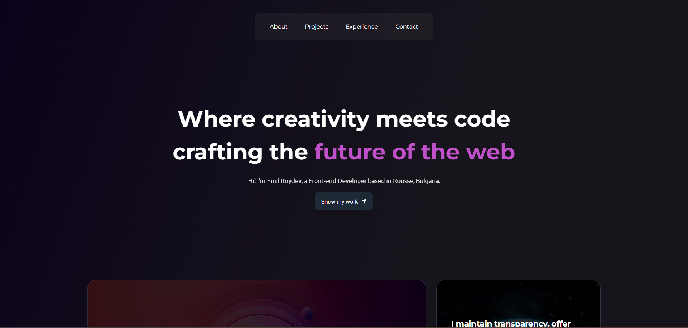

# Portfolio Website

## Overview

This project is a personal portfolio website designed to showcase my design and development skills. It uses ReactJS for building a dynamic and interactive user interface and Tailwind CSS for styling.

Link to the website: https://e-roydev-resume.onrender.com/
## Features

- Responsive design with Tailwind CSS
- Dynamic content rendered with ReactJS
- Sections include About Me, Projects, and Contact Form
- Modern web standards and best practices

## Tech Stack

- **ReactJS**: A JavaScript library for building user interfaces
- **Tailwind CSS**: A utility-first CSS framework
- **HTML5**: Markup language for creating web pages
- **CSS3**: Style sheet language for designing some animations
---

